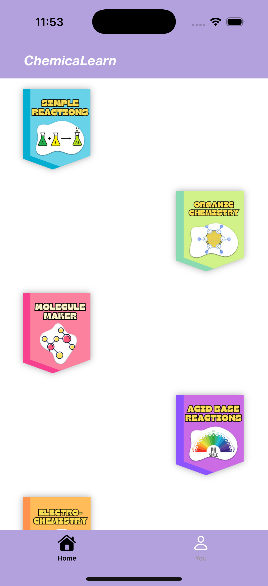
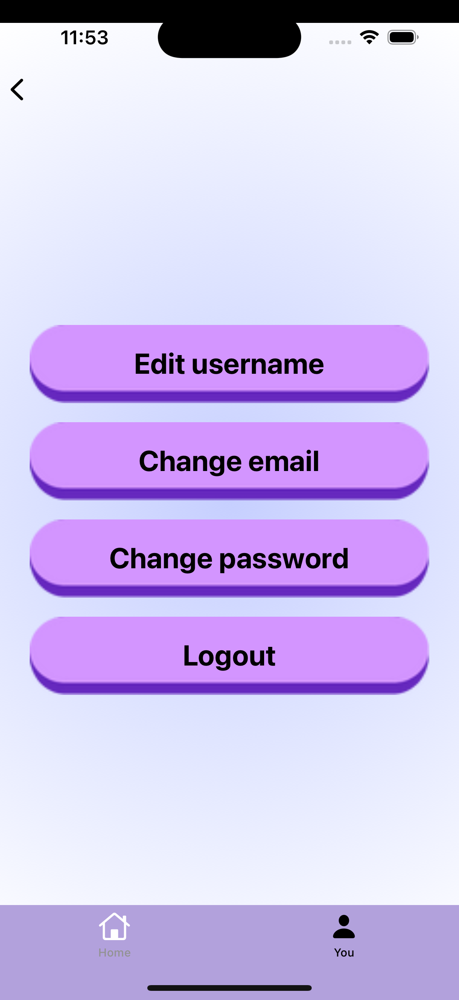
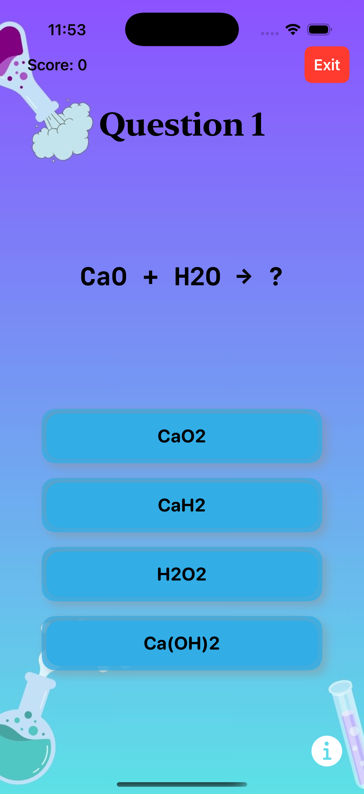
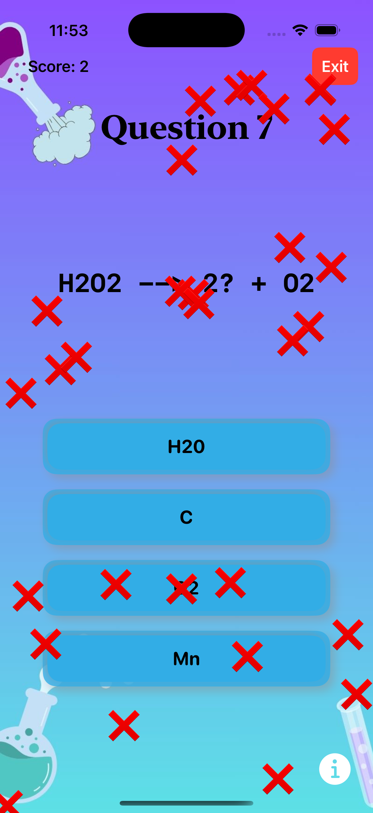
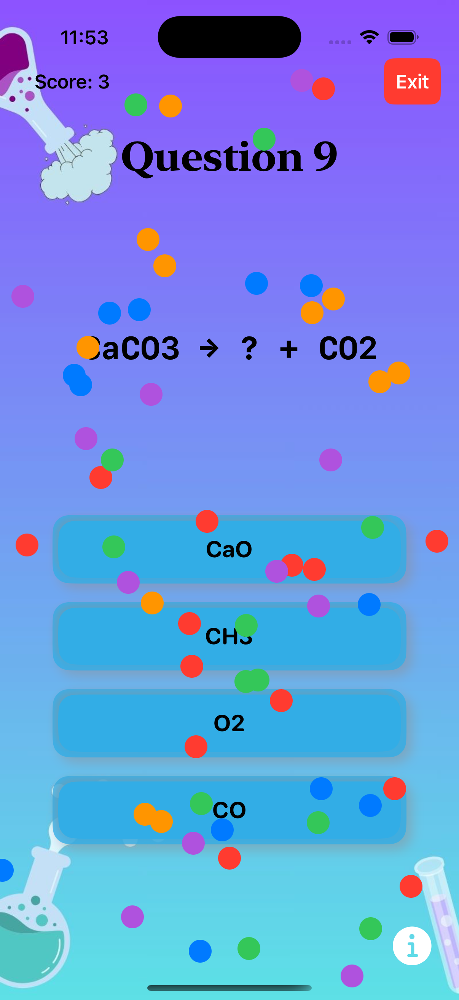
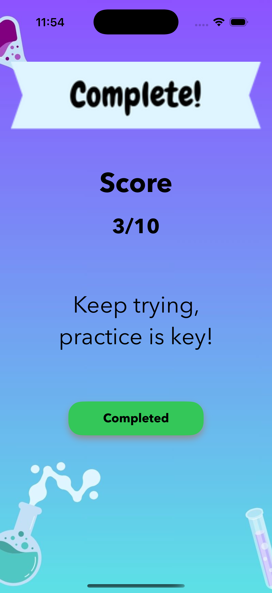
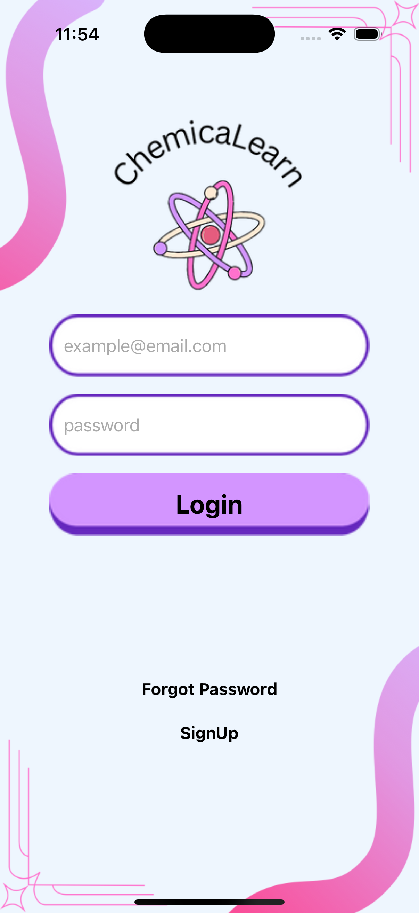
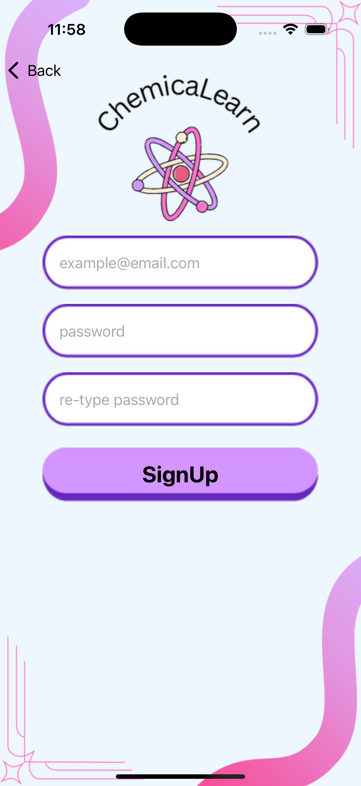

# **Chemistry Quiz App**

A fun and interactive way to test your chemistry knowledge! This iOS app offers quizzes, trivia, and challenges designed for students, teachers, and enthusiasts.

---

## **Features**
- 🧪 Multiple-choice quizzes on various chemistry topics.
- 🎨 Mockups designed in **Figma** and **Canva**.
- 🔄 Integration of **UIKit** and **SwiftUI** for a seamless user experience.
- 🌐 Backend powered by a **GraphQL API** (currently under development).

---

## **Technologies Used**
- **UIKit**: For initial app development.
- **SwiftUI**: Added to enhance the interface with modern design patterns.
- **GraphQL**: To enable efficient and flexible API queries.
- **Figma & Canva**: For creating app mockups and visual designs.

---

## **Screenshots From App**
**[App launch Website](https://angie633.github.io/ChemicaLearn.github.io/index.html)**
<div style="display: flex; flex-wrap: wrap; gap: 10px;">
  
  
  
  
  
  
  
  
</div>

---

## **Setup Instructions**
1. Clone the repository:
   ```bash
   git clone https://github.com/CodeWithTejpratab/ChemicaLearn.git
   ```
2. Navigate to the project folder and open the `.xcodeproj` file in Xcode.
3. Ensure you have the required dependencies installed (e.g., CocoaPods or Swift Package Manager).
4. Build and run the app on your simulator or connected device.

---

## **[GraphQL API](https://github.com/CodeWithTejpratab/MobileApi)**
Currently under development to provide:
- **Endpoints** for fetching quiz questions and answers.

---

## **Future Plans**
- Expand quiz topics and question types.

---


